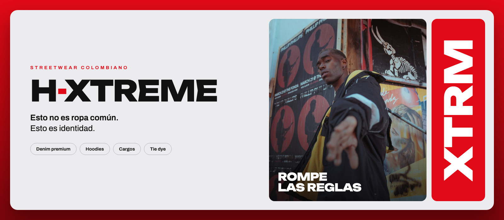

<p align="center">
  
</p>

# H-XTREME

**Esto no es ropa común. Esto es identidad.**

Sitio web de H-XTREME, marca colombiana de moda urbana: denim premium, hoodies, cargos y prendas customizadas (tie dye, reconstrucción, parches). No seguimos tendencias, las imponemos.

## Qué incluye la página

- Inicio con foto a pantalla grande, titular animado y pantalla de carga
- Colección en carrusel que avanza sola
- Manifiesto que se enciende palabra por palabra al hacer scroll
- Ficha de producto con tallas
- Reseñas de la comunidad
- Sección de taller y personalización
- Galería de estilo
- Diseño responsive y animaciones que respetan «reducir movimiento»

## Tecnología

Next.js 16 (App Router), React, TypeScript, Tailwind CSS 4, shadcn/ui, Motion y Lucide. Tipografías: Unbounded y Archivo (Google Fonts).

## Cómo correrla

Necesitas Node.js 18 o superior.

```bash
cd site
npm install
npm run dev
```

Abre http://localhost:3000.

Para generar la versión de producción:

```bash
npm run build
npm start
```

## Estructura

```
site/
├── public/images/      Fotos de la página
└── src/
    ├── app/            Página principal, estilos y metadatos
    └── components/     Secciones y efectos (hero, colección, cursor, etc.)
docs/
└── brand-context-h-xtreme.md   Identidad y tono de la marca
.github/workflows/      Publicación automática en GitHub Pages
```

## Marca

- **Color principal:** rojo intenso `#e10a17`, con negro, blanco y grises
- **Tono:** directo, seguro, moderno
- **Público:** 16 a 35 años, amantes del streetwear, los sneakers y la cultura urbana

## Pendientes

- Cambiar el número de WhatsApp de ejemplo (`57XXXXXXXXXX`) por el real
- Reemplazar las fotos de Unsplash por fotos propias de las prendas
- Reemplazar precios y reseñas de ejemplo por los reales

## Créditos

Fotos de [Unsplash](https://unsplash.com).

© 2026 H-XTREME. Todos los derechos reservados. Hecho en Colombia.
